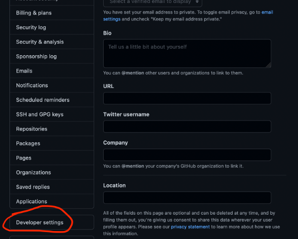

= NWT Documentation
ifndef::imagesdir[:imagesdir: images]
//:toc-placement!:  // prevents the generation of the doc at this position, so it can be printed afterwards
:sourcedir: ../src/main/java
:icons: font
:sectnums:    // Nummerierung der Überschriften / section numbering
:toc: left

=== Router konfigurieren im proxmoxx
- Neue CT anlegen
- IP - Adresse 10.9.8.253/29 und Gateway 255.255.255.192 vergeben
- [red]#SSH Verbindung nicht möglich#

=== Erstellen eines Containers

create user -> `$ adduser web`

`$ usermod -aG sudo web`

=== Connect with ssh

connect with ssh -> `$ ssh me@10.9.8.253`

image::ssh.png[]

=== Nginx installieren auf dem Webserver

`$ apt install ngnix-light`

=== Folge dem Tutorial auf nvs

:hide-uri-scheme:
https://nvs.htl-leonding.ac.at/script/n_deb.html

=== Aufrufen des Webservers

Die index.html Seite
die wir wie in dem Tutorial auf nvs beschrieben haben erstellt haben können wir nun über die IP-Adresse (10.9.8.97) erreichen.

image::episch.png[]

=== Pi hole

image::pi.png[300,300]

==== erstellen eines neuen Containers

*__Container bekommt eine statische IP-Adresse zwischen 10.9.8.97 - 10.9.8.102
__*

==== ssh Verbindung zum Pihole aufbauen

`$ ssh pihole@10.9.8.98`

Verbindung fehlgeschlagen (timeout ssh)

===== *update 27.02:*

##Fehler behoben -> Bridge war falsch konfiguriert##

**nach der Installation hier einloggen:**

:hide-uri-scheme:
http://10.9.8.98/admin/index.php

== F-C-A-P-S

image::fcaps.png[300,300]

=== Fault Management

=== Configuration Management

=== Accounting

=== Performance

epische games

=== Security

//Need this blank line after ifdef, don't know why...
ifdef::backend-html5[]

// print the toc here (not at the default position)
//toc::[]

== Pihole zu DNS Server machen

